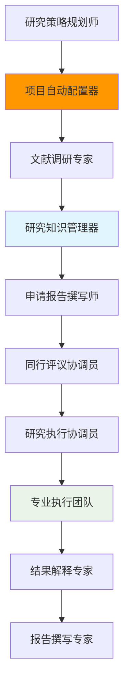

# BMAD Research Framework - 通用科研智能体框架

## 概述

BMAD Research Framework 是基于 BMAD-METHOD™ 构建的通用科学研究智能体框架，支持任意学科领域的科研项目规划、执行和报告撰写。该框架通过智能配置、知识驱动和同行评议机制，为科研工作者提供全生命周期的AI辅助支撑。

## 核心特性

### ✨ 通用性
- 适用于任意学科领域的科研项目
- 不局限于特定专业方向或研究类型
- 支持从基础研究到应用开发的各类项目

### 🤖 智能配置  
- 自动分析项目需求，识别所需专业领域
- 智能生成最优的专业智能体团队配置
- 用户可审查、修改和确认自动生成的配置

### 📚 知识驱动
- 基于深度文献调研构建结构化知识库
- 为申请报告和研究报告提供学术支撑
- 建立可追溯的引用关系和知识图谱

### 👥 同行评议
- 内置多层级同行评议机制
- 自动配置专业评议专家团队
- 确保研究质量和学术标准

### 🔄 动态协作
- 支持多专业智能体并行协作
- 实时协调和进度跟踪
- 灵活的团队组织和沟通机制

## 框架架构

### 智能体层次结构



### 四阶段工作流程

1. **规划配置阶段** (2-4周)
   - 研究策略规划
   - 自动项目配置
   - 用户配置审查

2. **研究准备阶段** (4-8周)  
   - 文献调研
   - 知识库构建
   - 申请报告撰写
   - 同行评议

3. **执行阶段** (核心研究周期)
   - 专业团队实例化
   - 协调式并行研究

4. **成果报告阶段** (2-4周)
   - 结果解释分析
   - 研究报告撰写
   - 最终同行评议

## 智能体说明

### 核心智能体

#### 🎯 研究策略规划师 (`research-strategy-planner`)
负责项目整体战略制定，包括可行性分析、风险评估、资源规划和里程碑设定。

#### 🤖 项目自动配置器 (`project-auto-configurator`)  
智能分析项目需求并自动生成最优的专业团队配置，包括专业智能体配置、评议专家配置和团队结构设计。

#### 📚 文献调研专家 (`literature-research-expert`)
进行深度文献调研和知识图谱构建，识别研究现状、空白和趋势。

#### 🗄️ 研究知识管理器 (`research-knowledge-manager`)
管理结构化研究知识库，为后续撰写工作提供查询接口和引用支撑。

#### 📄 申请报告撰写师 (`grant-application-writer`)
基于知识库撰写高质量的科研基金申请报告，专注于核心学术内容生成。

### 模板智能体

#### 🔬 研究专家模板 (`research-specialist-template`)
可配置的专业领域研究专家，根据项目需求动态实例化为不同专业方向的专家。

#### 👨‍🏫 同行评议专家模板 (`peer-reviewer-template`)  
可配置的专业评议专家，支持不同专业领域和评议重点的动态配置。

#### 👑 研究团队组长模板 (`research-lead-template`)
专业团队的领导智能体，负责团队内部协调和向上级汇报。

## 使用指南

### 快速开始

1. **激活研究策略规划师**
   ```
   *研究策略规划师
   ```

2. **进行项目规划**
   - 提供研究想法和基本要求
   - 获得可行性分析和策略建议

3. **自动配置团队**
   - 策略规划师会自动触发项目配置器
   - 审查和确认生成的团队配置

4. **开始研究流程**
   - 按照工作流程逐步推进
   - 利用各专业智能体的协作完成研究

### 典型使用场景

#### 场景1: 国自然基金申请
```yaml
# 项目配置示例
project_type: "水利工程调水项目"
complexity_level: "high"
identified_domains: ["水文学", "水力学", "结构工程", "环境工程"]

specialist_configuration:
  - domain: "水文学"
    knowledge_base: "hydrology-kb"  
    role: "水文数据采集与分析"
    priority: "high"
```

#### 场景2: 多学科交叉研究
```yaml
project_type: "生物医学工程交叉研究"
complexity_level: "medium"
identified_domains: ["生物医学", "材料科学", "机械工程"]

team_structure:
  recommended_teams: 3
  coordination_method: "matrix"
```

### 配置说明

所有专业智能体都通过配置文件进行动态实例化：

```yaml
# 专业智能体配置格式
- template: research-specialist-template
  domain: "专业领域名称"           # 如: "机器学习", "材料科学"
  knowledge_base: "对应知识库"     # 如: "ml-kb", "materials-kb"  
  role: "具体职责描述"            # 如: "算法设计与优化"
  priority: "优先级"             # high/medium/low
  team_assignment: 团队编号       # 1, 2, 3...
```

## 文件结构

```
bmad-research-framework/
├── agents/                    # 智能体定义文件
│   ├── research-strategy-planner.md
│   ├── project-auto-configurator.md
│   ├── literature-research-expert.md
│   ├── grant-application-writer.md
│   └── ...
├── templates/                 # 模板文件
│   ├── project-config-template.yaml
│   ├── nsfc-core-application-template.yaml
│   └── research-knowledge-base-template.yaml
├── tasks/                     # 任务定义文件
│   ├── generate-project-config.md
│   ├── write-nsfc-application.md
│   └── ...
├── workflows/                 # 工作流程定义
│   └── universal-research-workflow.yaml
├── agent-teams/              # 团队配置
│   └── research-full-team.yaml
├── checklists/               # 质量检查清单
│   └── config-completeness-checklist.md
├── data/                     # 知识库和参考资料
│   └── bmad-kb.md
└── config.yaml              # 扩展包配置
```

## 质量保证

### 多层级评议机制
- **申请阶段评议**: 确保项目方案科学可行
- **执行过程评议**: 监控研究质量和进展  
- **成果验证评议**: 验证研究结果可靠性

### 配置验证体系
- **完整性检查**: 确保配置覆盖所有技术需求
- **合理性验证**: 验证专业分布和团队结构
- **质量评估**: 评估配置方案的执行效果

### 知识质量控制
- **文献筛选**: 建立明确的文献纳入/排除标准
- **质量评估**: 评估文献的学术价值和可信度
- **持续更新**: 支持知识库的版本管理和更新

## 最佳实践

### 配置优化建议
- 专业智能体总数控制在4-8个
- 核心专业设置为高优先级
- 团队规模保持在2-4人
- 定期检查和调整配置

### 协作效率提升
- 明确各智能体职责边界
- 建立标准化数据交换格式
- 设置合理的沟通频率
- 及时处理协作冲突

### 质量标准把控
- 严格执行同行评议流程
- 建立可量化的质量指标
- 保持文献引用的准确性
- 确保输出内容的学术规范性

## 技术要求

- BMAD Core: ^4.0.0
- Node.js: >=20.0.0
- 支持YAML配置解析
- 支持Markdown文档生成

## 支持与反馈

如需技术支持或反馈问题，请：
- 查阅 `data/bmad-kb.md` 了解详细技术文档
- 使用相关智能体的 `*help` 命令获取帮助
- 通过项目配置器进行智能诊断和优化

---

**BMAD Research Framework** - 让AI成为科研工作的智能伙伴 🚀